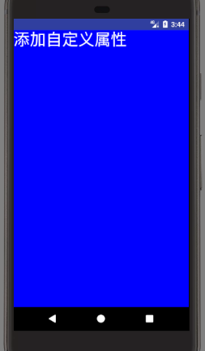

## 一个简单的演示
继承 view 并绘制文字及颜色

```
public class MyTextView extends View {

    Paint mPaint;
    String text;

    public MyTextView(Context context) {
        this(context, null);
    }

    public MyTextView(Context context, @Nullable AttributeSet attrs) {
        this(context, attrs, 0);
    }

    public MyTextView(Context context, @Nullable AttributeSet attrs, int defStyleAttr) {
        super(context, attrs, defStyleAttr);

        init(attrs);
    }

    private void init(AttributeSet attrs) {
        mPaint = new Paint(Paint.ANTI_ALIAS_FLAG);
//        mPaint.setColor(Color.RED);
        mPaint.setTextSize(100);
//        text = "这是文本信息";

        TypedArray a = getContext().obtainStyledAttributes(attrs, R.styleable.MyTextView);
        text = a.getString(R.styleable.MyTextView_text);
        int color = a.getColor(R.styleable.MyTextView_textColor, Color.BLACK);
        mPaint.setColor(color);
        a.recycle();
    }

    @Override
    protected void onMeasure(int widthMeasureSpec, int heightMeasureSpec) {
        super.onMeasure(widthMeasureSpec, heightMeasureSpec);
        int widthSize = MeasureSpec.getSize(widthMeasureSpec);
        int widthMode = MeasureSpec.getMode(widthMeasureSpec);

        int heightSize = MeasureSpec.getSize(heightMeasureSpec);
        int heightMode = MeasureSpec.getMode(heightMeasureSpec);

        Xlog.d("widthSize:" + widthSize + "  widthMode:" + getFriendlyModeName(widthMode)); //widthSize:1080  widthMode:AT_MOST
        Xlog.d("heightSize:" + heightSize + "  heightMode:" + getFriendlyModeName(heightMode));//heightSize:1704  heightMode:AT_MOST
    }

    private String getFriendlyModeName(int mode) {
        switch (mode) {
            case MeasureSpec.EXACTLY:
                return "EXACTLY";
            case MeasureSpec.AT_MOST:
                return "AT_MOST";
            case MeasureSpec.UNSPECIFIED:
                return "UNSPECIFIED";
        }
        return "UNKOWN";
    }

    @Override
    protected void onDraw(Canvas canvas) {
        super.onDraw(canvas);
        canvas.drawColor(Color.BLUE); // 绘制背景颜色
        /**
         * Draw the text, with origin at (x,y), using the specified paint. The origin is interpreted
         * based on the Align setting in the paint.
         *
         * @param text The text to be drawn
         * @param x The x-coordinate of the origin of the text being drawn
         * @param y The y-coordinate of the baseline of the text being drawn
         * @param paint The paint used for the text (e.g. color, size, style)
         */

        Rect bounds = new Rect();
        mPaint.getTextBounds(text, 0, text.length() - 1, bounds);
        canvas.drawText(text, 0, 0 + bounds.height(), mPaint);

    }

    @Override
    public boolean onTouchEvent(MotionEvent event) {
        switch (event.getAction()) {
            case MotionEvent.ACTION_DOWN:
                Log.d("xiaocai", "ACTION_DOWN DOWN DOWN DOWN   ==== ");
                break;
            case MotionEvent.ACTION_MOVE:
                Log.d("xiaocai", "ACTION_MOVE MOVE MOVE MOVE MOVE MOVE ");
                break;
            case MotionEvent.ACTION_UP:
                Log.d("xiaocai", "ACTION_UP UP UP UP UP UP ");
                break;
        }
        return true; // 需要返回 true 才能接受到后面的事件,要不然只能收到 ACTION_DOWN 的事件
//        return super.onTouchEvent(event);
    }
}

// 在 attrs.xml 文件中定义自定义属性
<declare-styleable name="MyTextView">
    <attr name="text" format="string"/>
    <attr name="textColor" format="color"/>
</declare-styleable>

// 在布局中使用
<com.charry.xandroid.ui.customview.MyTextView
    android:layout_width="wrap_content"
    android:layout_marginTop="20dp"
    app:text="添加自定义属性"
    app:textColor="@android:color/white"
    android:layout_height="wrap_content" />
```




## 一些关于自定义view的问题

### 1. 构造函数的调用时机
- 1: 一个参数的是代码中 new 的时候调用
- 2: 两个参数的是xml布局中使用了，并加载了该布局的时候调用
- 3: 三个参数的是xml布局中使用了并且加了 style 的属性，加载该布局时调用

### 2. 介绍下自定义 view ?
     主要涉及到的三个方法,onMeasure/onLayout/onDraw.分别对应 测量,布局和绘制.

### 3. MeasureSpec 有哪几种，分别有哪些对应？
- 1: EXACTLY:给定了具体的数值或 match_parent 
- 2: AT_MOST：给的是 wrap_content
- 3: UNSPECIFIED：很少用，在 scrollview 嵌套 Listview 时会出现

### 4. ScrollView 嵌套 ListView 只显示一个条目高度的问题
先分析原因：
```
    ListView 的 onMeasure 中给的高度就是 一个条目 + padding 的值：
// ListView 的 onMeasure 中
if (heightMode == MeasureSpec.UNSPECIFIED) {
    heightSize = mListPadding.top + mListPadding.bottom + childHeight + getVerticalFadingEdgeLength() * 2;
}
if (heightMode == MeasureSpec.AT_MOST) {
    heightSize = measureHeightOfChildren(widthMeasureSpec, 0, NO_POSITION, heightSize, -1);
}
```
    
    给的测量模式 UNSPECIFIED 导致的这个测量模式是 ScrollView 给的，去 ScrollView 的 onMeasure 中看下，并没有什么可疑的。
    因为 ScrollView 继承 FrameLayout，所以去看下 FrameLayout 中的 onMeasure 看看下：
```
    @Override
    protected void onMeasure(int widthMeasureSpec, int heightMeasureSpec) {
        int count = getChildCount();
        ...
        for (int i = 0; i < count; i++) {
            final View child = getChildAt(i);
            if (mMeasureAllChildren || child.getVisibility() != GONE) {
                // 这里调用了 测量方法  measureChildWithMargins
                measureChildWithMargins(child, widthMeasureSpec, 0, heightMeasureSpec, 0);
                final LayoutParams lp = (LayoutParams) child.getLayoutParams();
                maxWidth = Math.max(maxWidth,
                        child.getMeasuredWidth() + lp.leftMargin + lp.rightMargin);
                maxHeight = Math.max(maxHeight,
                        child.getMeasuredHeight() + lp.topMargin + lp.bottomMargin);
                childState = combineMeasuredStates(childState, child.getMeasuredState());
                if (measureMatchParentChildren) {
                    if (lp.width == LayoutParams.MATCH_PARENT ||
                            lp.height == LayoutParams.MATCH_PARENT) {
                        mMatchParentChildren.add(child);
                    }
                }
            }
        }
        ...
    }
    // ScrollView 重写了该方法， ScrollView 中的做法：
    @Override
    protected void measureChildWithMargins(View child, int parentWidthMeasureSpec, int widthUsed,
            int parentHeightMeasureSpec, int heightUsed) {
        final MarginLayoutParams lp = (MarginLayoutParams) child.getLayoutParams();
        final int childWidthMeasureSpec = getChildMeasureSpec(parentWidthMeasureSpec,
                mPaddingLeft + mPaddingRight + lp.leftMargin + lp.rightMargin
                        + widthUsed, lp.width);
        final int usedTotal = mPaddingTop + mPaddingBottom + lp.topMargin + lp.bottomMargin +
                heightUsed;
        // 这里给了测量模式为：UNSPECIFIED
        final int childHeightMeasureSpec = MeasureSpec.makeSafeMeasureSpec(
                Math.max(0, MeasureSpec.getSize(parentHeightMeasureSpec) - usedTotal),
                MeasureSpec.UNSPECIFIED);
        child.measure(childWidthMeasureSpec, childHeightMeasureSpec);
    }
 ```
总结下源码跟踪：
    ScrollView的onMeasure发现没什么，于是看下父类做了什么 --> FrameLayout的onMeasure 会调用measureChildWithMargins --> 这个方法ScrollView重写了 --> ScrollView的measureChildWithMargins中发现给高度设置了UNSPECIFIED

问题的根源是 父类给了UNSPECIFIED测量模式，我们只需要该掉这个模式为 AT_MOST 就能解决问题
解决办法：
```
@Override
protected void onMeasure(int widthMeasureSpec, int heightMeasureSpec){
    int heightSpec = MeasureSpec.makeMeasureSpec(Integer.MAX_VALUE >> 2, MeasureSpec.AT_MOST);
    super.onMeasure(widthMeasureSpec, heightSpec);
 }
 ```


