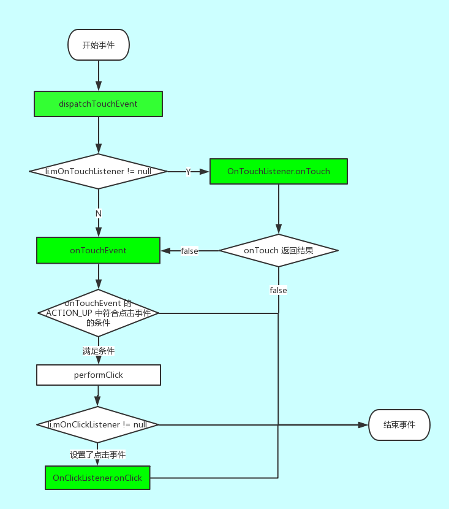

### View 的 dispatchTouchEvent OnTouchListener onTouchEvent OnClickListener 的联系

通过看源码来分析 View 事件分发过程（下面的代码是精简过后的）

（ViewGroup 会重写 dispatchTouchEvent，所以会不同）

```
public boolean dispatchTouchEvent(MotionEvent event) {
    boolean result = false;
    if (onFilterTouchEventForSecurity(event)) {
        ListenerInfo li = mListenerInfo; // 包含了很多的监听器（包括：OnTouchListener，OnClickListener...）
        if (li != null && li.mOnTouchListener != null
                && (mViewFlags & ENABLED_MASK) == ENABLED
                && li.mOnTouchListener.onTouch(this, event)) { // 这里点调用了 OnTouchListener.onTouch -> true 则 result = true
            result = true;
        }

        // result = true 则不走 onTouchEvent 了
        if (!result && onTouchEvent(event)) {
            result = true;
        }
    }
    return result;
}
```


可以看到 dispatchTouchEvent ：

* 先调用 OnTouchListener.onTouch
* 如果 onTouch 返回 false 则
* 调用 onTouchEvent(event)


目前没有看到 onClick 的身影，其实是在 onTouchEvent 中：
```
public boolean onTouchEvent(MotionEvent event) {
    if (clickable || (viewFlags & TOOLTIP) == TOOLTIP) {
        switch (action) {
            case MotionEvent.ACTION_UP:
                boolean prepressed = (mPrivateFlags & PFLAG_PREPRESSED) != 0;
                if ((mPrivateFlags & PFLAG_PRESSED) != 0 || prepressed) {
                    if (!mHasPerformedLongPress && !mIgnoreNextUpEvent) {
                        if (!focusTaken) {
                            if (!post(mPerformClick)) {
                                performClick(); // 经过一些判断后调用 performClick
                            }
                        }
                    }
                ...
                break;
            ...
        }
    }
}


public boolean performClick() {
    final boolean result;
    final ListenerInfo li = mListenerInfo;
    if (li != null && li.mOnClickListener != null) {
        playSoundEffect(SoundEffectConstants.CLICK);
        li.mOnClickListener.onClick(this); // 调用 OnClickListener.onClick
        result = true;
    } else {
        result = false;
    }
    return result;
}
```

在 onTouchEvent 中的 ACTION_UP 中判断一些条件是否满足调用点击事件，如果满足并且点击事件监听 mOnClickListener 不为 null 才去调用 OnClickListener.onClick

所以先后循序：
    dispatchTouchEvent => OnTouchListener  => onTouchEvent => OnClickListener

为什么是在 ACTION_UP 中判断呢？
> 1. 只有在抬起的时候才能确定这个事件会不会是 长点击 还是 普通的点击
> 2. 只能在其他操作完成之后才能得出是否需要触发 点击事件


最后一张流程图总结：




